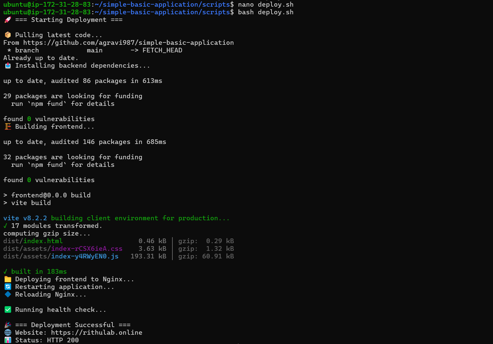

# 17 — 🚀 Deployment Procedure

> **Last Updated:** September 7, 2026

---

## 🎯 Goal

A repeatable process for deploying code changes to the server.

## ✅ Prerequisites

```text
[ ] ⚙️ Application fully deployed (from previous guides)
[ ] 🔐 SSH access to the server
```

## 🔄 Deployment Flow

```
👨‍💻 Developer
    ↓
🐙 GitHub (git push)
    ↓
🔐 SSH into EC2
    ↓
📦 git pull
    ↓
📥 Install dependencies
    ↓
🏗️ Build frontend
    ↓
🐘 Database migration (if needed)
    ↓
🔄 Restart application
    ↓
🔷 Reload Nginx
    ↓
✅ Health check
```

---

## 📝 Manual Deployment Steps

### Step 1 — 🔐 SSH into the server

```bash
ssh -i ~/Downloads/myapp-key.pem ubuntu@YOUR_EC2_PUBLIC_IP
```

### Step 2 — 📁 Navigate to the project

```bash
cd ~/simple-basic-application
```

### Step 3 — 🐙 Pull the latest code

```bash
git pull origin main
```

> 💡 Replace `main` with your branch name if different.

### Step 4 — 📦 Install backend dependencies

```bash
cd backend
npm install
```

### Step 5 — 📦 Install frontend dependencies

```bash
cd ../frontend
npm install
```

### Step 6 — 🏗️ Build the frontend

```bash
npm run build
```

### Step 7 — 📁 Copy build files to Nginx

```bash
sudo cp -r dist/* /var/www/myapp/
sudo chown -R www-data:www-data /var/www/myapp
```

### Step 8 — 🐘 Run database migrations (if needed)

Only if your schema changed:

```bash
cd ../backend

# 🐘 For Sequelize
npx sequelize db:migrate

# 💎 For Prisma
npx prisma migrate deploy

# 🏗️ For TypeORM
npx typeorm migration:run

# 🔧 For Knex
npx knex migrate:latest
```

> 💡 Skip this step if no database changes were made.

### Step 9 — 🔄 Restart the Node.js application

```bash
sudo systemctl restart myapp
```

### Step 10 — ✅ Verify it's running

```bash
sudo systemctl status myapp
```

Expected:

```text
🟢 Active: active (running)
```

### Step 11 — 🔷 Reload Nginx (if config changed)

```bash
sudo nginx -t
sudo systemctl reload nginx
```

> 💡 Only needed if you changed Nginx configuration.

### Step 12 — ✅ Health check

```bash
curl -I https://yourdomain.com
```

Expected: `🔒 HTTP/2 200`

```bash
curl https://yourdomain.com/api/health
```

Expected: A valid response. ✅

---

## 📝 Automated Deployment Script

Create a deployment script for convenience:

```bash
nano ~/simple-basic-application/scripts/deploy.sh
```

Paste:

```bash
#!/bin/bash
set -e

echo "🚀 === Starting Deployment ==="
echo ""

# 📁 Navigate to project
cd ~/simple-basic-application

# 🐙 Pull latest code
echo "📦 Pulling latest code..."
git pull origin main

# ⚡ Backend
echo "📥 Installing backend dependencies..."
cd backend
npm install

# 🎨 Frontend
echo "🏗️ Building frontend..."
cd ../frontend
npm install
npm run build

# 📁 Copy to Nginx
echo "📁 Deploying frontend to Nginx..."
sudo cp -r dist/* /var/www/myapp/
sudo chown -R www-data:www-data /var/www/myapp

# 🔄 Restart Node.js
echo "🔄 Restarting application..."
sudo systemctl restart myapp

# 🔷 Reload Nginx
echo "🔷 Reloading Nginx..."
sudo systemctl reload nginx

# ✅ Health check
echo ""
echo "✅ Running health check..."
sleep 2

HTTP_STATUS=$(curl -s -o /dev/null -w "%{http_code}" https://yourdomain.com)

if [ "$HTTP_STATUS" = "200" ]; then
    echo ""
    echo "🎉 === Deployment Successful ==="
    echo "🌐 Website: https://yourdomain.com"
    echo "📊 Status: HTTP $HTTP_STATUS"
else
    echo ""
    echo "⚠️ === Deployment May Have Issues ==="
    echo "📊 Status: HTTP $HTTP_STATUS"
    echo "🔍 Check logs: sudo journalctl -u myapp -f"
fi
```

Make it executable:

```bash
chmod +x ~/simple-basic-application/scripts/deploy.sh
```

### 🚀 Run the deployment

```bash
bash ~/simple-basic-application/scripts/deploy.sh
```

---

## ✅ Checkpoint

At this point:

```text
[✓] 📝 Manual deployment steps documented
[✓] 🚀 Deploy script created
[✓] 🔐 Deploy script is executable
[✓] ✅ Deployment tested and working
```

> 📸 **Screenshot:** Capture the terminal showing `bash ~/simple-basic-application/scripts/deploy.sh` output with "Deployment Successful" message.
> 

> 🎉 If all checks pass, continue to: [✅ Final Validation](18-final-validation.md).

---

## 🔧 Troubleshooting

### ❓ "git pull fails"

Check if you have local changes:

```bash
git status
```

If you modified files on the server, stash them:

```bash
git stash
git pull origin main
```

### ❓ "npm install fails after pull"

Delete and reinstall:

```bash
rm -rf node_modules package-lock.json
npm install
```

### ❓ "Build fails"

Check for errors in the build output. Common issues:

- 🔐 Missing environment variables in frontend `.env`
- ❌ TypeScript errors
- 📦 Missing dependencies

### ❓ "Deploy script fails midway"

Run the steps manually to identify which step failed. Fix the issue, then re-run the script.

---

## 🎉 Done

You have a repeatable deployment process. 🚀 Next, run the final validation checklist. ✅
